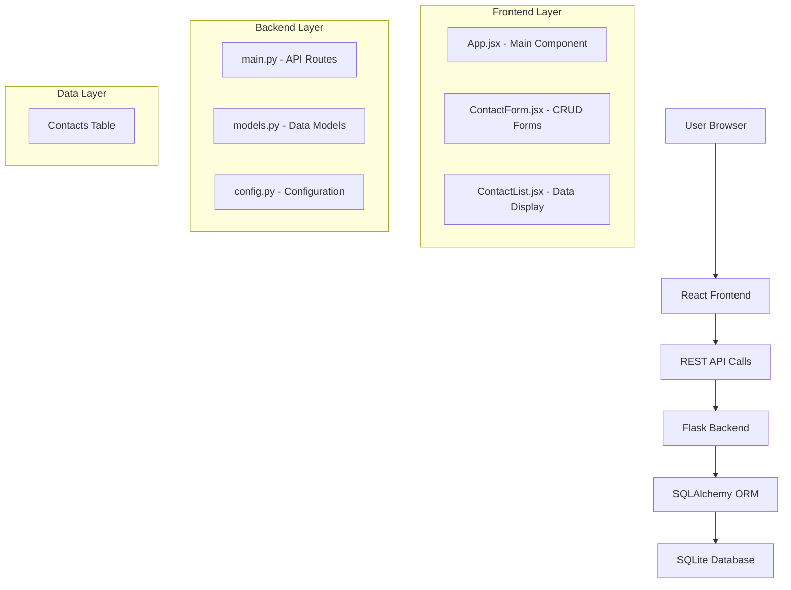

# Contact Management System

**Developer:** Bhushan Rane  
**Technology Stack:** React.js + Flask + SQLAlchemy + SQLite  
**Version:** 1.0.0  

## Project Overview

A full-stack web application for managing personal and professional contacts. The system allows users to create, read, update, and delete contact information with a modern, responsive user interface.

##  Features

- Add new contacts with first name, last name, and email
- View all contacts in a structured table format
- Update existing contact information
- Delete contacts from the system
- Real-time data synchronization between frontend and backend
- Responsive design for mobile and desktop
- Error handling and validation
- Professional UI with developer branding

## Technology Stack

### Frontend
- **React.js** - Modern JavaScript library for building user interfaces
- **Vite** - Fast build tool and development server
- **CSS3** - Styling and responsive design
- **JavaScript ES6+** - Modern JavaScript features

### Backend
- **Flask** - Python web framework for API development
- **SQLAlchemy** - Python SQL toolkit and Object-Relational Mapping (ORM)
- **SQLite** - Lightweight, serverless database engine
- **Python 3.x** - Backend programming language

## Project Structure

```
StoreContacts/
│
├── frontend/                 # React.js Frontend Application
│   ├── src/
│   │   ├── App.jsx          # Main application component
│   │   ├── ContactForm.jsx  # Form component for creating/updating contacts
│   │   ├── ContactList.jsx  # Component for displaying contacts list
│   │   ├── main.jsx         # Application entry point
│   │   ├── App.css          # Application styles
│   │   └── index.css        # Global styles
│   ├── index.html           # HTML template
│   ├── package.json         # Node.js dependencies
│   └── vite.config.js       # Vite configuration
│
├── backend/                 # Flask Backend API
│   ├── main.py             # Main Flask application with API routes
│   ├── models.py           # Database models (Contact)
│   ├── config.py           # Flask and database configuration
│   └── instance/
│       └── database.db     # SQLite database file
│
└── README.md               # Project documentation
```

---

## HIGH-LEVEL DESIGN (HLD)

### System Architecture



### Component Architecture

#### Frontend Architecture
```
┌─────────────────────────────────────────┐
│                App.jsx                  │
│  ┌─────────────────┐ ┌─────────────────┐│
│  │  ContactForm    │ │  ContactList    ││
│  │                 │ │                 ││
│  │ - Add Contact   │ │ - Display       ││
│  │ - Edit Contact  │ │ - Update        ││
│  │ - Validation    │ │ - Delete        ││
│  └─────────────────┘ └─────────────────┘│
└─────────────────────────────────────────┘
```

#### Backend API Architecture
```
┌─────────────────────────────────────────┐
│              Flask App                  │
│  ┌─────────────────────────────────────┐│
│  │           API Routes                ││
│  │  GET    /contacts                   ││
│  │  POST   /create_contact             ││
│  │  PATCH  /update_contact/<id>        ││
│  │  DELETE /delete_contact/<id>        ││
│  │  GET    / (API Info)                ││
│  │  GET    /developer (Dev Info)       ││
│  └─────────────────────────────────────┘│
│  ┌─────────────────────────────────────┐│
│  │          SQLAlchemy ORM             ││
│  │  Contact Model:                     ││
│  │  - id (Primary Key)                 ││
│  │  - first_name                       ││
│  │  - last_name                        ││
│  │  - email (Unique)                   ││
│  └─────────────────────────────────────┘│
└─────────────────────────────────────────┘
```

### Data Flow

1. **User Interaction** → Frontend React Components
2. **Frontend** → Makes HTTP requests to Flask API
3. **Flask API** → Processes requests and interacts with database via SQLAlchemy
4. **Database** → Returns data to Flask API
5. **Flask API** → Returns JSON response to Frontend
6. **Frontend** → Updates UI with new data

---

## LOW-LEVEL DESIGN (LLD)

### Database Schema

#### Contact Table
```sql
CREATE TABLE contact (
    id INTEGER PRIMARY KEY AUTOINCREMENT,
    first_name VARCHAR(50) NOT NULL,
    last_name VARCHAR(50) NOT NULL,
    email VARCHAR(120) UNIQUE NOT NULL
);
```

**Fields Description:**
- `id`: Auto-incrementing primary key
- `first_name`: Contact's first name (max 50 characters)
- `last_name`: Contact's last name (max 50 characters)  
- `email`: Unique email address (max 120 characters)

### API Endpoints

#### 1. GET /contacts
**Purpose:** Retrieve all contacts  
**Response:**
```json
{
  "contacts": [
    {
      "id": 1,
      "first_name": "John",
      "last_name": "Doe",
      "email": "john.doe@example.com"
    }
  ]
}
```

#### 2. POST /create_contact
**Purpose:** Create new contact  
**Request Body:**
```json
{
  "firstName": "John",
  "lastName": "Doe", 
  "email": "john.doe@example.com"
}
```
**Response:**
```json
{
  "message": "User created!"
}
```

#### 3. PATCH /update_contact/<user_id>
**Purpose:** Update existing contact  
**Request Body:**
```json
{
  "firstName": "John",
  "lastName": "Smith",
  "email": "john.smith@example.com"
}
```
**Response:**
```json
{
  "message": "User updated."
}
```

#### 4. DELETE /delete_contact/<user_id>
**Purpose:** Delete contact  
**Response:**
```json
{
  "message": "User deleted!"
}
```

### Frontend Component Details

#### App.jsx (Main Component)
**State Management:**
- `contacts`: Array of all contacts
- `isModalOpen`: Boolean for modal visibility
- `currentContact`: Selected contact for editing

**Key Methods:**
- `fetchContacts()`: GET request to retrieve all contacts
- `openCreateModal()`: Opens modal for new contact creation
- `openEditModal(contact)`: Opens modal for contact editing
- `onUpdate()`: Refreshes contact list after CRUD operations

#### ContactForm.jsx (Form Component)
**State Management:**
- `firstName`: Form field state
- `lastName`: Form field state
- `email`: Form field state
- `updating`: Boolean to determine create vs update mode

**Key Methods:**
- `onSubmit()`: Handles form submission for create/update

#### ContactList.jsx (Display Component)
**Props:**
- `contacts`: Array of contacts to display
- `updateContact`: Function to trigger edit modal
- `updateCallback`: Function to refresh data

**Key Methods:**
- `onDelete(id)`: DELETE request to remove contact

### Error Handling

#### Frontend Error Handling
- Form validation for required fields
- Network error handling with try-catch blocks
- User-friendly error messages via alerts
- Graceful degradation when backend is unavailable

#### Backend Error Handling
- Input validation for required fields
- Database constraint handling (unique email)
- HTTP status codes (200, 201, 400, 404)
- Exception handling with rollback for database operations

### Security Considerations

1. **Input Validation:** All form inputs validated on both client and server
2. **SQL Injection Prevention:** Using SQLAlchemy ORM for database operations
3. **CORS:** Configured for cross-origin requests between frontend and backend
4. **Error Messages:** Generic error messages to avoid information leakage

---

## Installation & Setup

### Prerequisites
- Node.js (v14 or higher)
- Python 3.x
- pip (Python package installer)

### Backend Setup
```bash
cd backend
pip install flask flask-sqlalchemy flask-cors
python main.py
```

### Frontend Setup  
```bash
cd frontend
npm install
npm run dev
```

### Access Points
- **Frontend:** http://localhost:5173
- **Backend API:** http://127.0.0.1:5000
- **API Documentation:** http://127.0.0.1:5000/developer

## Usage

1. **Adding Contacts:** Click "Create New Contact" button, fill the form, and submit
2. **Viewing Contacts:** All contacts are displayed in a table format
3. **Updating Contacts:** Click "Update" button next to any contact
4. **Deleting Contacts:** Click "Delete" button next to any contact

## 🔮 Future Enhancements

- [ ] Search and filter functionality
- [ ] Contact categories/groups
- [ ] Export contacts to CSV
- [ ] Import contacts from file
- [ ] Contact profile pictures
- [ ] Advanced validation (phone numbers, addresses)
- [ ] Authentication and user management
- [ ] Pagination for large datasets

## Developer Information

**Name:** Bhushan Rane  
**Project Type:** Full Stack Web Development  
**Development Period:** November 2025  
**Technologies Mastered:** React.js, Flask, SQLAlchemy, REST API Development

## License

This project is developed for educational and portfolio purposes by Bhushan Rane.

---

*Crafted with ❤️ by Bhushan Rane | Full Stack Developer**
